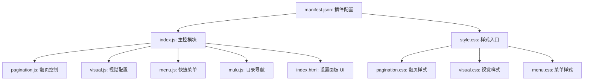

# TwT (阅读) 拓展开发记录与项目梳理

本拓展是为 **SillyTavern (酒馆)** 开发的一个第三方插件，旨在将传统的上下滚动阅读模式转变为**左右翻页阅读模式**（类似于电子书），并且集成了目录生成、视觉自定义、优化补丁和快捷操作菜单等功能。

---

## 🛠️ 项目开发原则 (Development Rules)
1. **中文沟通与小白友好**：所有沟通均使用中文，避免使用过于高深的技术术语。不对用户的编程经验做任何假设。
2. **严禁编造接口/API**：遇到需要 SillyTavern 接口支持的功能时，若缺乏知识库，应列出具体所需信息由用户去查找官方文档/社区，不得随意猜测或编造。
3. **功能修改须用户确认**：不可随意新增或删除功能。任何设计改动、新点子在实施前，必须向用户进行建议，获得明确同意后方可编码。
4. **移动端与低性能设备适配**：本拓展主要在手机等移动设备上使用。在后续的代码编写中，需注意：
   - 避免频繁或碎片化地启用 GPU 合成层（`will-change`），防止内存占用过高。
   - 优化触摸和滚动事件，避免卡顿。
   - 保持 CSS 与 JS 的高效简洁。

---

## 📂 项目结构与模块梳理

项目目录包含以下文件，其结构和分工如下：

### 1. 配置文件
* **[manifest.json](file:///d:/SillyTavern/public/scripts/extensions/third-party/TwT/manifest.json)**：
  * 插件基本信息。名称为“阅读”，作者为“食熊则肥”，版本为 `1.0.0`。
  * 指定了入口 JS 为 `index.js`，全局 CSS 为 `style.css`。
* **[style.css](file:///d:/SillyTavern/public/scripts/extensions/third-party/TwT/style.css)**：
  * 简单的样式入口，只负责导入（`@import`）`pagination.css`、`visual.css` 和 `menu.css`。

### 2. UI 界面与主控
* **[index.html](file:///d:/SillyTavern/public/scripts/extensions/third-party/TwT/index.html)**：
  * SillyTavern 扩展设置面板的 HTML 结构。
  * 采用分 Tab 页面设计，包含：**设置**（启用各个功能的主开关）、**翻页**（防误触白名单等）、**菜单**（长按/双击召出及功能控制）、**视觉**（边距、字号等）、**目录**（正则匹配及按钮）、**优化**（酒馆主题优化补丁）。
* **[index.js](file:///d:/SillyTavern/public/scripts/extensions/third-party/TwT/index.js)**：
  * **核心主控程序**：初始化默认设置（`defaultSettings`）和默认补丁（`defaultPatches`）。
  * 负责管理所有的配置读取和保存（利用酒馆底层的 `getContext().saveSettingsDebounced`）。
  * 绑定 UI 面板中的所有输入框、开关、按钮事件。
  * 注入自定义的 CSS 优化补丁（例如“隐藏滚动条”、“禁用聊天区域长按菜单”、“收藏栏图标缩小”等）。

### 3. 核心功能模块
* **[pagination.js](file:///d:/SillyTavern/public/scripts/extensions/third-party/TwT/pagination.js) & [pagination.css](file:///d:/SillyTavern/public/scripts/extensions/third-party/TwT/pagination.css)**：
  * **翻页实现**：使用 CSS 的多列布局（`column-width`）将整个 `#chat` 聊天区变成横向流式排列，每一列宽度等于聊天视口宽度。
  * **滑动与点击**：
    * 监听点击屏幕左右两侧进行翻页。支持设置“类名/选择器白名单”防止在点击某些特定元素时误触发翻页。
    * 手动接管了触摸滑动逻辑，避免使用不稳定的 CSS scroll-snap，并通过手势跟手与松手时的吸附算法（Snap）保障在低端设备上也有平滑顺畅的翻页体验。
  * 包含“消息分页”模式，开启后每条消息会强制另起一页开始渲染。
* **[visual.js](file:///d:/SillyTavern/public/scripts/extensions/third-party/TwT/visual.js) & [visual.css](file:///d:/SillyTavern/public/scripts/extensions/third-party/TwT/visual.css)**：
  * **排版微调**：允许用户设置阅读区域的顶部/底部留白、左/右边距、字体大小和行高，提供了更沉浸的阅读观感。
  * 支持自定义视觉预设的保存、重命名和删除。
* **[mulu.js](file:///d:/SillyTavern/public/scripts/extensions/third-party/TwT/mulu.js)**：
  * **自动提取目录**：遍历当前会话的所有 AI 消息，使用正则表达式提取出符合条件的文本（例如 `第X章`、`Markdown标题` 等）并生成目录。
  * **目录弹窗**：在屏幕上渲染一个目录列表，支持标题模糊搜索、正序/倒序排列。点击即可跳转到对应的聊天楼层（若该楼层已在 DOM 中被隐藏，会自动触发加载）。
  * **快捷悬浮按钮**：在酒馆快捷栏中注入“回到开头”、“回到结尾”以及“打开目录”的按钮。
* **[menu.js](file:///d:/SillyTavern/public/scripts/extensions/third-party/TwT/menu.js) & [menu.css](file:///d:/SillyTavern/public/scripts/extensions/third-party/TwT/menu.css)**：
  * **快捷操作菜单**：通过长按某条消息（后续可扩展其他召出方式），在点击位置弹出浮动菜单。
  * 当前已实现的按钮：
    * **重新生成**（触发酒馆重新生成最后一条 AI 消息）。
    * **滑动**（触发最后一条 AI 消息的左右滑动换差分）。
  * 菜单中预留了占位项（目前显示为置灰且无实际逻辑）：**编辑**、**隐藏**、**摘抄**、**删除**。

---

## 📝 待开发与优化事项 (TODO)
目前从代码和配置中整理出的后续开发方向（需根据用户需求逐步实施）：
1. **完善消息菜单占位功能**（须在用户提出具体需求并同意后开发）：
   - `编辑`：编辑当前选中的消息。
   - `隐藏`：隐藏/归档消息。
   - `摘抄`：将文本提取到备忘录或剪贴板。
   - `删除`：从会话中删除该条消息。
2. **移动端适配调试与 Bug 修复**：
   - 关注在低端手机上由于消息极多时，CSS 多列（`column`）排版可能引起的重排（reflow）性能瓶颈。
   - 调试在移动端不同浏览器/壳子里横向滑动手势的冲突。
3. **SillyTavern 接口对接**：
   - 整理插件运行所需的 SillyTavern 内置变量与 API 接口（如控制消息生成、编辑消息内容的具体 API 名字）。
